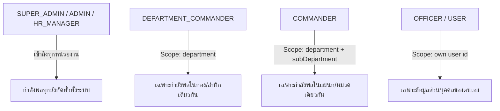

# 🛡️ Permission Matrix & Security Specification — eProfile System

> **เวอร์ชันระบบ:** v1.3.0  
> **อัปเดตล่าสุด:** 2026-09-08  
> **สถานะ:** Active Specification (Single Source of Truth)  
> **ไฟล์อ้างอิงโค้ด:** [src/lib/role-definitions.ts](file:///Users/cangsalak/project/eprofile/src/lib/role-definitions.ts), [src/lib/auth-guards.ts](file:///Users/cangsalak/project/eprofile/src/lib/auth-guards.ts)

---

## 1. รายการสิทธิ์ทั้งหมดในระบบ (System Permissions)

### 1.1 Core Permissions (สิทธิ์หลักของระบบ)

| Permission Key | ชื่อสิทธิ์ | คำอธิบายรายละเอียด |
|---|---|---|
| `MANAGE_PERSONNEL` | จัดการข้อมูลบุคลากร | เพิ่ม ลบ แก้ไข ข้อมูลประวัติ กำลังพล และพิมพ์บัตรประจำตัว |
| `MANAGE_SYSTEM` | จัดการระบบและการตั้งค่า | จัดการโครงสร้างองค์กร, บทบาท (Roles), ข้อมูลยานพาหนะ, ปฏิทิน และการตั้งค่าระบบ |
| `MANAGE_POSTS` | จัดการข่าวสารและสื่อ | สร้าง แก้ไข ลบ เผยแพร่บทความ ข่าวสาร และไฟล์มีเดีย |
| `APPROVE_LEAVE` | อนุมัติการลางาน | ตรวจสอบ อนุมัติ หรือปฏิเสธคำขอลาของกำลังพลในสังกัด (Scoped) |
| `VIEW_AUDIT_LOGS` | ดูประวัติการทำงาน | เข้าถึงบันทึก Forensic Audit Logs และประวัติกิจกรรมความมั่นคงปลอดภัย |
| `VIEW_COMMAND_DASHBOARD` | ดูแดชบอร์ดผู้บังคับบัญชา | เข้าถึงแดชบอร์ดสรุปยอดกำลังพล สถิติความพร้อมรบ และการลา (Scoped) |

### 1.2 Module & Extension Permissions (สิทธิ์เฉพาะโมดูลส่วนขยาย)

| Permission Key | โมดูล | คำอธิบาย |
|---|---|---|
| `MANAGE_ROLES` | Personnel / System | สร้าง แก้ไข และกำหนดสิทธิ์ของ System Roles |
| `MANAGE_DEPARTMENTS` | Personnel / System | จัดการโครงสร้างกอง/ฝ่าย และแผนก/หมวด/ตอน |
| `MANAGE_CONTACTS` | Contacts | จัดการข้อมูลติดต่อ แผนที่ และอ่านข้อความร้องเรียน |
| `MANAGE_MENUS` | Menus | จัดการโครงสร้างและจัดเรียงแถบนำทาง (Sidebar Navigation) |
| `MANAGE_THEME` | Theme | ปรับแต่งโทนสี แบรนด์ โลโก้ และการแสดงผล |
| `MANAGE_BACKUP` | Backup | สิทธิ์สำรอง กู้คืน และดาวน์โหลดฐานข้อมูล |
| `MANAGE_SALARY_SLIP` | Test Slip | จัดการ นำเข้า และออกสลิปเงินเดือนของกำลังพลทั้งหมด |
| `VIEW_OWN_SLIP` | Test Slip | ดูและพิมพ์สลิปเงินเดือนเฉพาะของตนเอง |

---

## 2. บทบาทและตารางสิทธิ์เริ่มต้น (Default Role Matrix)

อ้างอิงจาก `ROLE_DEFINITIONS` ในระบบ:

| Role Name | ชื่อบทบาท (ไทย) | MANAGE_PERSONNEL | MANAGE_SYSTEM | MANAGE_POSTS | APPROVE_LEAVE | VIEW_AUDIT_LOGS | VIEW_COMMAND_DASHBOARD |
|---|---|:---:|:---:|:---:|:---:|:---:|:---:|
| `SUPER_ADMIN` | ผู้ดูแลระบบสูงสุด | ✅ | ✅ | ✅ | ✅ | ✅ | ✅ |
| `ADMIN` | ผู้ดูแลระบบ | ✅ | ✅ | ✅ | ✅ | ✅ | ✅ |
| `HR_MANAGER` | เจ้าหน้าที่บุคคล | ✅ | ❌ | ❌ | ✅ | ✅ | ✅ |
| `DEPARTMENT_COMMANDER` | ผบ.ระดับกอง/สำนัก | ❌ | ❌ | ❌ | ✅ | ❌ | ✅ |
| `COMMANDER` | ผบ.หน่วยย่อย/แผนก | ❌ | ❌ | ❌ | ✅ | ❌ | ✅ |
| `EDITOR` | บรรณาธิการ | ❌ | ❌ | ✅ | ❌ | ❌ | ❌ |
| `OFFICER` | เจ้าหน้าที่ | ❌ | ❌ | ❌ | ❌ | ❌ | ❌ |
| `USER` | ผู้ใช้งานทั่วไป | ❌ | ❌ | ❌ | ❌ | ❌ | ❌ |

> 👑 **สิทธิ์เฉพาะระดับ `SUPER_ADMIN`:**  
> - รีเซ็ต/ล้างฐานข้อมูลระบบ (`/api/admin/database-reset`) พร้อม Password Re-authentication  
> - ติดตั้ง ถอดถอน และเปิด/ปิด โมดูลระบบ (`/api/modules`)  
> - ตรวจสอบช่องโหว่และสแกนระบบผ่าน System Inspector (`/manage/inspector`)  
> - ดูเอกสาร Interactive API Documentation 93 endpoints (`/manage/api-docs`)  
> - แก้ไขแบบฟอร์ม ทบ.100-009 (RPB-1) ของกำลังพลทุกคนในระบบ

---

## 3. กฎการควบคุมขอบเขตข้อมูลตามสายการบังคับบัญชา (Scoped Access Rules)

ระบบ eProfile ใช้สถาปัตยกรรม **Database Query Layer Scoping** เพื่อป้องกันการเข้าถึงข้อมูลข้ามหน่วยงาน:

| บทบาท | ขอบเขตการดูแดชบอร์ดความพร้อมรบ | ขอบเขตการอนุมัติใบลา | ข้อจำกัดพิเศษ |
|---|---|---|---|
| `SUPER_ADMIN` / `ADMIN` | ทั่วทั้งองค์กร (All Departments) | ทั่วทั้งองค์กร | อนุมัติใบลาของตนเองไม่ได้ (Anti-Self Approval) |
| `HR_MANAGER` | ทั่วทั้งองค์กร (All Departments) | ทั่วทั้งองค์กร | อนุมัติใบลาของตนเองไม่ได้ |
| `DEPARTMENT_COMMANDER` | เฉพาะใน `department` ของตนเอง | เฉพาะผู้ขอลาใน `department` เดียวกัน | ไม่อนุญาตให้อนุมัติใบลาข้ามกอง |
| `COMMANDER` | เฉพาะใน `department` และ `subDepartment` | เฉพาะผู้ขอลาใน `subDepartment` เดียวกัน | ไม่อนุญาตให้อนุมัติข้ามแผนก |
| `OFFICER` / `USER` | ไม่มีสิทธิ์เข้าถึง | ไม่มีสิทธิ์เข้าถึง | ยื่นคำขอลาและดูสถานะของตนเองเท่านั้น |

---

## 4. ตารางความสัมพันธ์ API Endpoints และสิทธิ์ (API ↔ Permission Mapping)

### 4.1 Authentication & Profile APIs

| Endpoint | Method | Security Guard / Requirement | รายละเอียด |
|---|---|---|---|
| `/api/auth/login` | POST | Public + Rate Limited | ตรวจสอบรหัสผ่าน + Account Lockout 5 ครั้ง |
| `/api/auth/logout` | POST | `requireAuth` | ล้าง HTTP-only Cookie + บันทึก Audit Log |
| `/api/auth/me` | GET | `requireAuth` | ดึงข้อมูล Session, Role และ Permissions ปัจจุบัน |
| `/api/auth/forgot-password` | POST | Public + Rate Limited | ตรวจสอบเลขบัตรประชาชน + วันเกิด + เบอร์โทร |
| `/api/auth/reset-password` | POST | Single-use Token Verification | รีเซ็ตรหัสผ่านใหม่ตาม Password Policy |
| `/api/auth/change-password` | POST | `requireAuth` | เปลี่ยนรหัสผ่านของตนเอง |

### 4.2 Personnel & Directory APIs

| Endpoint | Method | Security Guard / Requirement | รายละเอียด |
|---|---|---|---|
| `/api/personnel` | GET | `requireAuth` | ค้นหาและดูทำเนียบกำลังพล (Public fields) |
| `/api/personnel` | POST | `requirePermission('MANAGE_PERSONNEL')` | สร้างข้อมูลบุคลากรใหม่ |
| `/api/personnel/[id]` | GET | `requireAuth` | ดูประวัติกำลังพลรายบุคคล |
| `/api/personnel/[id]` | PUT | `MANAGE_PERSONNEL` หรือ เจ้าของ Profile | แก้ไขข้อมูลประวัติ |
| `/api/personnel/[id]` | DELETE | `requirePermission('MANAGE_PERSONNEL')` | ลบข้อมูลบุคลากร |
| `/api/personnel/stats` | GET | `requireAuth` | สถิติกำลังพลจำแนกตามสังกัด/สถานะ |
| `/api/personnel/export` | GET | `requirePermission('MANAGE_PERSONNEL')` | ส่งออก CSV พร้อมบันทึก Audit Log |

### 4.3 Leave Management APIs

| Endpoint | Method | Security Guard / Requirement | รายละเอียด |
|---|---|---|---|
| `/api/leaves` | GET | `requireAuth` | ดึงประวัติการลา (ผู้ใช้ทั่วไปเห็นเฉพาะของตน) |
| `/api/leaves` | POST | `requireAuth` | ยื่นใบลาใหม่พร้อมคำนวณวันลาอัตโนมัติ |
| `/api/leaves/[id]` | GET | `requireAuth` (เจ้าของ หรือ ผู้บังคับบัญชา) | ดูรายละเอียดใบลา |
| `/api/leaves/approvals` | GET | `requirePermission('APPROVE_LEAVE')` | รายการรออนุมัติ (Department/Sub Scoped) |
| `/api/leaves/[id]/approve` | POST | `requirePermission('APPROVE_LEAVE')` | อนุมัติใบลา (Atomic DB Tx + Scoped) |
| `/api/leaves/[id]/reject` | POST | `requirePermission('APPROVE_LEAVE')` | ปฏิเสธใบลา (Atomic DB Tx + Scoped) |
| `/api/dashboard/command` | GET | `requirePermission('VIEW_COMMAND_DASHBOARD')` | สถิติความพร้อมรบและกำลังพล (Scoped) |

### 4.4 แบบฟอร์ม ทบ.100-009 (RPB-1 Security Profile Form)

| Endpoint | Method | Security Guard / Requirement | รายละเอียด |
|---|---|---|---|
| `/api/rpb1/[personnelId]` | GET | เจ้าของ / `ADMIN` (Read-only) / `SUPER_ADMIN` | ดึงข้อมูลฟอร์ม 10 หน้า |
| `/api/rpb1/[personnelId]` | POST | เจ้าของ / `SUPER_ADMIN` (`ADMIN` ทำไม่ได้) | บันทึกข้อมูลฟอร์ม 10 หน้า |
| `/api/rpb1/[personnelId]/pdf` | GET | เจ้าของ / `ADMIN` / `SUPER_ADMIN` | พิมพ์รายงานเอกสารทางการ |

### 4.5 System, Operations & Admin APIs

| Endpoint | Method | Security Guard / Requirement | รายละเอียด |
|---|---|---|---|
| `/api/roles` | GET, POST | `requirePermission('MANAGE_SYSTEM')` | จัดการ System Roles |
| `/api/departments` | GET, POST, PUT, DELETE | `requirePermission('MANAGE_SYSTEM')` | จัดการโครงสร้างกอง/ฝ่าย |
| `/api/vehicles` | GET, POST, PUT, DELETE | `requirePermission('MANAGE_SYSTEM')` | จัดการข้อมูลยานพาหนะ |
| `/api/calendar` | GET, POST, PUT, DELETE | `requireAuth` (แก้ไขต้องมีสิทธิ์) | ปฏิทินปฏิบัติงานและเวรยาม |
| `/api/media` | GET, POST, DELETE | `requirePermission('MANAGE_POSTS')` | คลังสื่อและรูปภาพ |
| `/api/audit-logs` | GET | `requirePermission('VIEW_AUDIT_LOGS')` | ตรวจสอบ Forensic Audit Logs |
| `/api/backup` | GET | `requireRole(['SUPER_ADMIN', 'ADMIN'])` | สำรองฐานข้อมูล (JSON / SQLite) |
| `/api/restore` | POST | `requireRole(['SUPER_ADMIN', 'ADMIN'])` | กู้คืนฐานข้อมูลจากไฟล์สำรอง |
| `/api/admin/database-reset`| POST | `requireRole(['SUPER_ADMIN'])` + Re-Auth | ล้างฐานข้อมูลเริ่มต้นใหม่ |
| `/api/admin/inspector` | ANY | `requireRole(['SUPER_ADMIN'])` | ตรวจสอบช่องโหว่ความปลอดภัย |
| `/api/admin/api-docs` | GET | `requireRole(['SUPER_ADMIN'])` | ระบบเอกสาร API 93 Endpoints |
| `/api/modules` | GET, POST, DELETE | `requireRole(['SUPER_ADMIN'])` | ติดตั้ง/ถอนการติดตั้งโมดูล ZIP |
| `/api/install` | POST | Admin Secret Header / First-time only | Wizard ติดตั้งระบบครั้งแรก |

---

## 5. นโยบายความปลอดภัยของระบบ (Security Policies)

### 5.1 Password Policy
- ความยาวขั้นต่ำ **8 ตัวอักษร** (สูงสุดไม่เกิน 128 ตัวอักษร)
- ต้องประกอบด้วยตัวพิมพ์ใหญ่อย่างน้อย 1 ตัว (`A-Z`)
- ต้องประกอบด้วยตัวพิมพ์เล็กอย่างน้อย 1 ตัว (`a-z`)
- ต้องประกอบด้วยตัวเลขอย่างน้อย 1 ตัว (`0-9`)
- แฮชรหัสผ่านด้วย `bcryptjs` (Cost Factor: 10)

### 5.2 Account Lockout Policy
- ล็อกอินผิดติดต่อกันครบ **5 ครั้ง** บัญชีจะถูกระงับชั่วคราว **15 นาที** อัตโนมัติ
- รีเซ็ตเลขนับความผิดพลาดทันทีเมื่อเข้าสู่ระบบสำเร็จ

### 5.3 Session & Cookie Policy
- เซสชันทำงานผ่าน **JWT Token** อายุการใช้งาน **24 ชั่วโมง**
- คุกกี้ตั้งค่า `HttpOnly=true`, `SameSite=Lax`
- บังคับ `Secure=true` เมื่อใช้งานบนสภาพแวดล้อม Production (HTTPS)
- เมื่อทำการ Logout จะทำลาย Cookie และบันทึก Audit Log ทันที

### 5.4 Anti-Self Approval & Audit Trail Policy
- ผู้บังคับบัญชาหรือผู้มีสิทธิ์อนุมัติ **ไม่สามารถอนุมัติใบลาของตนเองได้** (ระบบบล็อกที่ Backend API)
- ทุกคำขออนุมัติ/ปฏิเสธ/แก้ไขข้อมูลสำคัญ จะถูกบันทึกผ่าน **Database Transaction** ควบคู่กับ **Audit Log** เสมอ
